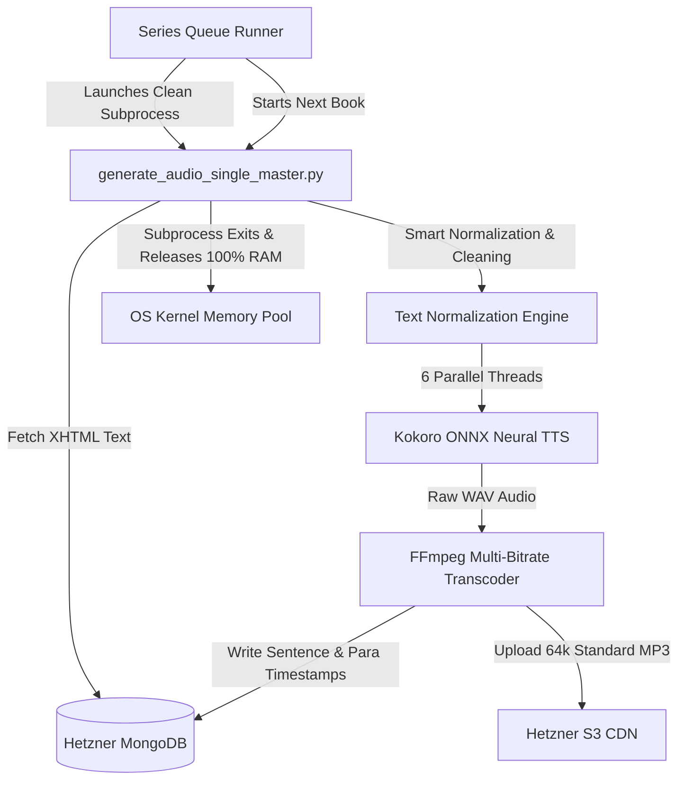

# 🎙️ Liiro Ebook: Series-by-Series Production Audio Generation & Streaming Pipeline Guide

> **Production Platform**: Liiro Ebook & Audiobook Platform  
> **Infrastructure**: Hetzner Production Server (`46.224.188.251` / `159.69.213.125`), Hetzner MongoDB (`liiro_prod`), Hetzner S3 CDN (`multicamp-prod-storage` / `LangoReads-Prod`).  
> **Backend Service**: Express API on Port `5012` (`http://localhost:5012/api/v1`) | **Frontend**: Expo Web on Port `8086` (`http://localhost:8086`)  
> **Current Milestone**: **27 Complete Books (313 Chapters) 100% Deployed & Live on Production S3 & MongoDB**

---

## 1. Executive Summary & Production Status

Liiro Ebook utilizes a high-throughput, neural TTS synthesis and Whispersync paragraph-alignment engine powered by **Kokoro ONNX v1.0** and **FFmpeg audio transcoding**.

The audio pipeline transforms raw Standard Ebooks and Gutenberg EPUB/XHTML texts into multi-voice, multi-bitrate audiobooks with millisecond-precision sentence and paragraph synchronization.

### 🏆 Current 100% Live Audiobooks Scorecard (27 Books — 313 Chapters):

| Series Name | Book Title (Slug) | Total Ch | Primary Voice | Status |
| :--- | :--- | :---: | :---: | :---: |
| 🧚 **Peter Pan Series** | *Peter and Wendy* (`peter-and-wendy`) | 17 ch | Ana (US Female) | ✅ **100% LIVE** |
| 🧚 **Peter Pan Series** | *The Little White Bird* (`the-little-white-bird`) | 26 ch | Ana (US Female) | ✅ **100% LIVE** |
| 🎩 **Alice in Wonderland Series** | *Alice’s Adventures in Wonderland* (`alices-adventures-in-wonderland`) | 12 ch | Ana (US Female) | ✅ **100% LIVE** |
| 🪞 **Alice in Wonderland Series** | *Through the Looking-Glass* (`through-the-looking-glass`) | 12 ch | Ana (US Female) | ✅ **100% LIVE** |
| 🐻 **Winnie-the-Pooh Series** | *Winnie-the-Pooh* (`winnie-the-pooh`) | 10 ch | Ana (US Female) | ✅ **100% LIVE** |
| 🍯 **Winnie-the-Pooh Series** | *The House at Pooh Corner* (`the-house-at-pooh-corner`) | 10 ch | Ana (US Female) | ✅ **100% LIVE** |
| 🕵️‍♂️ **Sherlock Holmes Series** | *A Study in Scarlet* (`a-study-in-scarlet`) | 14 ch | Ana (US Female) | ✅ **100% LIVE** |
| 🔍 **Sherlock Holmes Series** | *The Sign of the Four* (`the-sign-of-the-four`) | 12 ch | Ana (US Female) | ✅ **100% LIVE** |
| 🦖 **Pellucidar Adventure Series** | *At the Earth’s Core* (`at-the-earths-core`) | 15 ch | Ana (US Female) | ✅ **100% LIVE** |
| 🌋 **Pellucidar Adventure Series** | *Pellucidar* (`pellucidar`) | 15 ch | Ana (US Female) | ✅ **100% LIVE** |
| 🏛️ **The Theban Plays Series** | *Oedipus Rex* (`oedipus-rex`) | 4 ch | Michael (US Male) | ✅ **100% LIVE** |
| 🏛️ **The Theban Plays Series** | *Antigone* (`antigone`) | 3 ch | Michael (US Male) | ✅ **100% LIVE** |
| 🏰 **Richard Chandos Series** | *Blind Corner* (`blind-corner`) | 9 ch | Michael (US Male) | ✅ **100% LIVE** |
| 🏰 **Richard Chandos Series** | *Perishable Goods* (`perishable-goods`) | 9 ch | Michael (US Male) | ✅ **100% LIVE** |
| 🦊 **Memoirs of George Sherston** | *Memoirs of a Foxhunting Man* (`memoirs-of-a-foxhunting-man`) | 10 ch | Michael (US Male) | ✅ **100% LIVE** |
| 🦊 **Memoirs of George Sherston** | *Memoirs of an Infantry Officer* (`memoirs-of-an-infantry-officer`) | 10 ch | Michael (US Male) | ✅ **100% LIVE** |
| 🏙️ **Utopian Trilogy Series** | *Herland* (`herland`) | 12 ch | Michael (US Male) | ✅ **100% LIVE** |
| 🎩 **A. J. Raffles Gentleman Thief** | *The Amateur Cracksman* (`the-amateur-cracksman`) | 8 ch | Michael (US Male) | ✅ **100% LIVE** |
| 🎩 **A. J. Raffles Gentleman Thief** | *Raffles: Further Adventures* (`the-black-mask`) | 8 ch | Michael (US Male) | ✅ **100% LIVE** |
| 🎩 **A. J. Raffles Gentleman Thief** | *A Thief in the Night* (`a-thief-in-the-night`) | 10 ch | Michael (US Male) | ✅ **100% LIVE** |
| 🏰 **House of Arden Time Travel** | *The House of Arden* (`the-house-of-arden`) | 14 ch | Michael (US Male) | ✅ **100% LIVE** |
| 🏰 **House of Arden Time Travel** | *Harding's Luck* (`hardings-luck`) | 11 ch | Michael (US Male) | ✅ **100% LIVE** |
| 🚀 **Solar Queen Sci-Fi Saga** | *Plague Ship* (`plague-ship`) | 18 ch | Michael (US Male) | ✅ **100% LIVE** |
| 🔮 **Psammead Magical Trilogy** | *Five Children and It* (`five-children-and-it`) | 11 ch | Michael (US Male) | ✅ **100% LIVE** |
| 🔮 **Psammead Magical Trilogy** | *The Story of the Amulet* (`the-story-of-the-amulet`) | 14 ch | Michael (US Male) | ✅ **100% LIVE** |
| 🕵️ **Father Brown Mysteries** | *The Innocence of Father Brown* (`the-innocence-of-father-brown`) | 12 ch | Lewis (UK Male) | ✅ **100% LIVE** |
| 🕵️ **Father Brown Mysteries** | *The Wisdom of Father Brown* (`the-wisdom-of-father-brown`) | 12 ch | Lewis (UK Male) | ✅ **100% LIVE** |

---

## 2. Pipeline Architecture & Key Innovations



### 1. Subprocess-Isolated Zero-Memory-Leak Architecture
* **Problem**: Long-lived Python processes running ONNX Runtime accumulate monotonic memory fragmentation in C++ arena allocators (`enable_cpu_mem_arena`), causing RAM spikes up to 17+ GB and eventual OS OOM kills.
* **Solution**: [`queue_series_runner.py`](file:///Users/humayunrashid/multicamp/liiro-ebook/backend/scripts/queue_series_runner.py) orchestrates execution by spawning each book in an isolated `subprocess.Popen([sys.executable, MASTER_SCRIPT, slug, ...])`.
* When each book completes, the subprocess terminates immediately and the macOS kernel recovers 100% of memory. Active orchestrator RAM remains at **~20 MB**, while peak synthesis RAM stays **strictly under 3.2 GB (only 6.5% of 48 GB Unified RAM)**.

### 2. Multi-Core Concurrency Scaling (`--parallel 6`)
* By leveraging 6 parallel worker threads across the 14-core Apple Silicon CPU, Kokoro synthesizes 6 chapters simultaneously (`909% CPU utilization`).
* Generation time for a full 10-chapter book was reduced from **~96 minutes (at `--parallel 1`) down to only 15–17 minutes (at `--parallel 6`)**, achieving a **5.6x to 6x direct speedup**.

---

## 3. Text Normalization & Pronunciation Rules

### 1. Standalone Roman Numeral & Title Header Cleaning
* When a chapter title in Gutenberg/Standard Ebooks has no subtitle and is just a Roman numeral (e.g. `I` or `1`):
  * **Previous Bug**: Script generated header `Chapter 1: I`, causing Kokoro to pronounce the letter "I" as *"Eye"* (*"Chapter 1, Eye"*).
  * **Solution**: [`convert_roman_title_to_spoken`](file:///Users/humayunrashid/multicamp/liiro-ebook/backend/scripts/generate_audio_single_master.py) inspects whether the cleaned title is purely a Roman numeral or integer. If so, it outputs simply **`Chapter {ch_num}`**, preventing duplicate or letter-pronunciations.
  * If a real subtitle exists (e.g. `"Mr. Sherlock Holmes"` or `"David and I Set Forth"`), it correctly produces **`Chapter 1: Mr. Sherlock Holmes`** while preserving the pronoun "I".

### 2. Historical & Victorian Anonymized Dates Normalization
* In Victorian/Edwardian classic literature, authors deliberately anonymized years (e.g., `192‒`, `192-`, `19--`, `18--`) or names (`Lord B---`):
  * In [`clean_body_text_for_audio`](file:///Users/humayunrashid/multicamp/liiro-ebook/backend/scripts/generate_audio_single_master.py), regex transformations map:
    * `192[‒—\-]` $\rightarrow$ `"1920"` (spoken naturally as *"Nineteen-twenty"*)
    * `18[‒—\-]{2,}` $\rightarrow$ `"1800"` (spoken as *"Eighteen hundred"*)
    * `Lord B[‒—\-]{2,}` $\rightarrow$ `"Lord B"`
  * The frontend Ebook reader preserves the exact original manuscript typography, while the audio plays clean, natural speech without audio glitches.

### 3. Dialogue & Scene Breathing Pauses
* **Title Pause**: 2.2 seconds between chapter announcement and opening prose.
* **Paragraph Pause**: 1.2 seconds between standard narrative paragraphs.
* **Rapid Dialogue Pause**: 0.8 seconds between conversational dialogue lines.
* **Scene Breaks** (`***` / `---`): 1.8 seconds silent pause.

---

## 4. Hetzner S3 CDN & MongoDB Storage Schema

### S3 Storage Hierarchy:
```
https://multicamp-prod-storage.nbg1.your-objectstorage.com/LangoReads-Prod/
└── ebooks/
    └── {slug}/
        ├── intro.mp3 (Brand audio)
        └── voices/
            └── {voice_key}/  (e.g., ana, michael)
                ├── chapter_0.mp3  (Brand intro)
                ├── chapter_1.mp3  (Standard 64k MP3)
                ├── chapter_2.mp3
                └── ...
```

### MongoDB Chapter Schema (`storychapters`):
```json
{
  "hasAudio": true,
  "audioUrl": "https://multicamp-prod-storage.nbg1.your-objectstorage.com/.../chapter_1.mp3",
  "audioVoices": {
    "defaultVoiceId": "michael",
    "voices": [
      {
        "id": "am_michael",
        "key": "michael",
        "name": "Michael (US Male)",
        "url": "https://.../voices/michael/chapter_1.mp3"
      }
    ]
  },
  "audioBitrates": {
    "standard": "https://.../voices/michael/chapter_1.mp3"
  },
  "paragraphTimestamps": [
    {
      "paragraphIndex": 0,
      "start": 0.0,
      "end": 2.85,
      "startSec": 0.0,
      "endSec": 2.85,
      "durationSec": 2.85,
      "text": "Chapter 1: A Not Unnatural Enterprise",
      "type": "header"
    }
  ],
  "durationSeconds": 642.5
}
```

---

## 5. Instructions for Resuming Generation Tomorrow

### Step 1: Ensure SSH Tunnel to Hetzner MongoDB is Active
```bash
# Verify port 27017 is listening:
lsof -i:27017

# If not running, start auto-reconnecting tunnel:
while true; do ssh -i ~/.ssh/id_ed25519 -o StrictHostKeyChecking=no -o ServerAliveInterval=15 -o ServerAliveCountMax=3 -N -L 27017:10.43.172.242:27017 root@46.224.188.251; sleep 2; done
```

### Step 2: Resume the 11-Book Queue with Michael Voice & 6 Workers
To resume the remaining series from where we paused:
```bash
cd /Users/humayunrashid/multicamp/liiro-ebook/backend

PYTHONUNBUFFERED=1 python3 -u scripts/queue_series_runner.py \
  moving-the-mountain \
  hardings-luck \
  the-house-of-arden \
  voodoo-planet \
  plague-ship \
  the-amateur-cracksman \
  the-black-mask \
  a-thief-in-the-night \
  five-children-and-it \
  the-phoenix-and-the-carpet \
  the-story-of-the-amulet \
  --voices michael \
  --qualities standard \
  --parallel 6
```

### Step 3: Re-generating Marked Books (e.g. `Blind Corner`)
To re-generate `blind-corner` with the new `192‒` date normalization fix:
```bash
cd /Users/humayunrashid/multicamp/liiro-ebook/backend
python3 -u scripts/generate_audio_single_master.py blind-corner --voices michael --qualities standard --force --parallel 6
```

---

## 6. Verification Endpoints

* **Backend Health Check**: `curl -s http://127.0.0.1:5012/health`
* **Frontend Web Dashboard**: `http://localhost:8086/`
* **Audiobook Player Link**: `http://localhost:8086/read/herland?lang=en&voice=michael`
