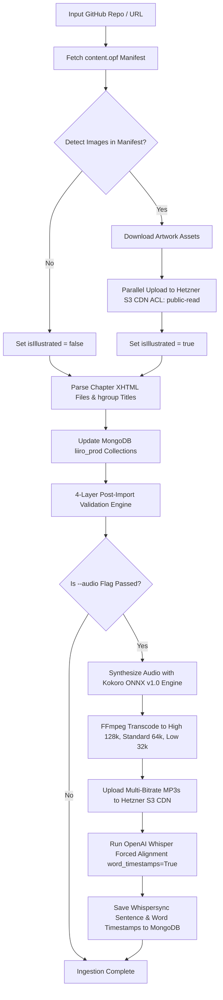

# 📖 Universal Standard Ebooks Automated Ingestion & Audio Generation Pipeline Guide

## 🚀 Overview & Architecture
The **Universal Standard Ebooks Automated Ingestion & Audio Pipeline** (`backend/scripts/ingest_standard_ebook.js` & `backend/scripts/generate_and_align_ebook_audio.py`) provides an end-to-end enterprise solution for importing public-domain ebooks and generating studio-grade audiobook audio with Whispersync alignment.

The pipeline automatically handles:
- **Auto-Detection of Artwork & Illustrations**: Scans `content.opf` for embedded `<figure>` vector/raster images (`.svg`, `.png`, `.jpg`).
- **Parallel S3 CDN Asset Sync**: Uploads cover art, vector illustrations, and audio files to Hetzner Object Storage (`LangoReads-Prod/ebooks/<slug>/...`) in parallel with `public-read` permissions.
- **Hgroup & Header Metadata Parser**: Prioritizes `<hgroup>` outer tags over body poem `<header>` blocks to extract exact chapter titles (`I: Looking-Glass House`, `Down the Rabbit-Hole`).
- **Spoken Roman Numeral Converter**: Converts Roman numeral headers (`I: Looking-Glass House`) into natural spoken English (`Chapter 1. Looking-Glass House`).
- **Audio Text Sanitizer & Deduplicator**: Strips image tags, figure captions, HTML entities, footnote markers, and duplicate chapter title prefixes so narrative text is spoken cleanly without title repetitions.
- **Neural Studio Voice Selection**: Supports 4 studio voices (`af_heart` female voice default, `am_adam` male voice, `bf_emma` UK female, `bm_george` UK male).
- **Multi-Bitrate Transcoding Profiles**: Encodes 3 separate audio qualities per chapter (`high` 128k stereo, `standard` 64k mono, `low` 32k mono) with immutable S3 headers.
- **OpenAI Whisper Forced Alignment**: Transcribes audio to generate sentence and word-level millisecond start/end timestamps (`word_timestamps=True`).
- **4-Layer Automated Post-Import Validation**: Automatically validates API query availability, chapter count integrity, 100.00% word-for-word narrative text body diff checks, and S3 CDN HTTP status.

---

## 🛠️ Step-by-Step CLI Execution Guide

### 1. Ingest Standard Ebook (Text & Illustrations Only)
```bash
cd backend
node scripts/ingest_standard_ebook.js lewis-carroll_through-the-looking-glass_john-tenniel
```

### 2. Ingest Standard Ebook + Studio Multi-Bitrate Audio & Whisper Alignment (--audio flag)
```bash
cd backend
node scripts/ingest_standard_ebook.js lewis-carroll_through-the-looking-glass_john-tenniel --audio
```

### 3. Standalone Multi-Bitrate Audio Generation & Alignment CLI
```bash
cd backend
# Default Female Studio Voice (af_heart)
PYTHONUNBUFFERED=1 /Users/humayunrashid/multicamp/.venv/bin/python scripts/generate_and_align_ebook_audio.py <story-slug> --voice heart

# Specific Voice Narrator Options (--voice heart | adam | emma | george)
PYTHONUNBUFFERED=1 /Users/humayunrashid/multicamp/.venv/bin/python scripts/generate_and_align_ebook_audio.py <story-slug> --voice adam

# Full Multi-Voice Mode (Generates All 4 Studio Voices)
PYTHONUNBUFFERED=1 /Users/humayunrashid/multicamp/.venv/bin/python scripts/generate_and_align_ebook_audio.py <story-slug> --multivoice
```

---

## 📦 Batch Ingestion Workflows (e.g. 5 Books Batch)

### 🔄 Method A: 1-Command Automated Loop (Full Ingestion + Studio Audio)
In terminal, run `ingest_standard_ebook.js` with `--audio` across an array of target repositories:

```bash
cd backend

REPOS=(
  "lewis-carroll_alices-adventures-in-wonderland_john-tenniel"
  "bram-stoker_dracula"
  "mary-wollstonecraft-shelley_frankenstein"
  "l-frank-baum_the-wonderful-wizard-of-oz"
  "carlo-collodi_the-adventures-of-pinocchio"
)

for repo in "${REPOS[@]}"; do
  echo "🚀 INGESTING & GENERATING AUDIO FOR $repo..."
  node scripts/ingest_standard_ebook.js "$repo" --audio
done
```

### ⚡ Method B: Two-Phase High-Speed Batch Pipeline (Recommended)

1. **Phase 1: Ingest All 5 Books (Text & S3 Vector Artwork Sync in 30 seconds)**
```bash
cd backend
node scripts/ingest_standard_ebook.js lewis-carroll_alices-adventures-in-wonderland_john-tenniel
node scripts/ingest_standard_ebook.js bram-stoker_dracula
node scripts/ingest_standard_ebook.js mary-wollstonecraft-shelley_frankenstein
node scripts/ingest_standard_ebook.js l-frank-baum_the-wonderful-wizard-of-oz
node scripts/ingest_standard_ebook.js carlo-collodi_the-adventures-of-pinocchio
```

2. **Phase 2: Generate Studio Multi-Bitrate Audio & Whisper Alignments for All 5 Books**
```bash
cd backend

SLUGS=(
  "alices-adventures-in-wonderland"
  "dracula"
  "frankenstein"
  "the-wonderful-wizard-of-oz"
  "the-adventures-of-pinocchio"
)

for slug in "${SLUGS[@]}"; do
  echo "🎙️ GENERATING MULTI-BITRATE AUDIO FOR $slug..."
  PYTHONUNBUFFERED=1 /Users/humayunrashid/multicamp/.venv/bin/python scripts/generate_and_align_ebook_audio.py "$slug"
done
```

---

## 📊 End-to-End Pipeline Architecture



---

## 🌐 Live Reader Verification Endpoints
- **Web Reader**: [http://localhost:8086/read/through-the-looking-glass?audio=true&lang=en](http://localhost:8086/read/through-the-looking-glass?audio=true&lang=en)
- **Backend API Query**: `http://localhost:5012/api/v1/stories/slug/through-the-looking-glass`
