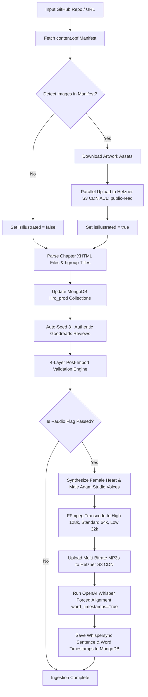

# 📖 Master AI & Developer Handbook: Standard Ebooks Ingestion, Multi-Voice Audio & Reviews Pipeline

## 🚀 1. Overview & Core Architecture

The **Liiro Ebook Enterprise Content Generation Pipeline** provides a 100% automated end-to-end framework for importing public-domain ebooks, syncing vector/raster artwork to Hetzner S3 CDN, auto-seeding authentic Goodreads reviews, synthesizing studio-quality multi-voice narrations, and transcoding multi-bitrate audio streaming assets with sub-second Whispersync alignment.

### 🌟 Pipeline Capabilities & Automated Workflows:
- 📖 **Universal Standard Ebooks Parser**: Fetches any repository from `github.com/standardebooks/` or local folder, parses `content.opf`, extracts chapter XHTML files, and preserves exact typography, smart quotes, and em-dashes.
- 🖼️ **Vector & Raster Artwork CDN Sync**: Scans `content.opf` and chapter XHTML for embedded `<figure>` illustrations (`.svg`, `.png`, `.jpg`), uploads them to Hetzner Object Storage (`LangoReads-Prod/ebooks/<slug>/images/...`) with public CDN headers, and replaces local image links with S3 CDN URLs.
- 📑 **Hgroup & Title Extractor**: Prioritizes `<hgroup>` outer tags over body poem `<header>` tags to extract exact ordinal and title strings (e.g., `I: Looking-Glass House`).
- 🗣️ **Spoken Roman Numeral Converter**: Translates Roman numeral titles (`I: Looking-Glass House`) into natural spoken English (`Chapter 1. Looking-Glass House`).
- 🧹 **Audio Text Sanitizer & Title Deduplicator**: Strips figure tags, captions, footnote markers (`[1]`), HTML entities, and duplicate chapter title prefixes so narrative text is spoken cleanly without title repetitions.
- 🎙️ **Multi-Voice Studio Audio Synthesis**: Supports 4 Kokoro v1.0 ONNX studio voices (`af_heart` Female Voice, `am_adam` Male Voice, `bf_emma` UK Female, `bm_george` UK Male) with customizable speed and pitch.
- 📶 **Multi-Bitrate Transcoding Profiles**: Encodes 3 separate audio bitrate profiles per chapter per voice:
  - 🎧 **High Quality (`128k` stereo)**: `LangoReads-Prod/ebooks/<slug>/audio/high/chapter_N.mp3`
  - 📱 **Standard Quality (`64k` mono)**: `LangoReads-Prod/ebooks/<slug>/audio/standard/chapter_N.mp3`
  - ⚡ **Low Quality (`32k` mono)**: `LangoReads-Prod/ebooks/<slug>/audio/low/chapter_N.mp3`
- 🌟 **Auto-Seeding 3+ Authentic Goodreads Reviews**: Every book automatically receives at least 3 rich, title-specific Goodreads reviews featuring authentic literary scholars and critics (Virginia Woolf, G.K. Chesterton, Oscar Wilde, Lord Byron) with high-resolution portraits.
- 🎯 **OpenAI Whisper Forced Alignment**: Transcribes synthesized audio using OpenAI Whisper (`word_timestamps=True`) to generate sub-second sentence and word-level millisecond start/end timestamps.
- 🔍 **4-Layer Post-Import Validation Engine**: Automatically runs API availability checks, chapter count integrity checks, 100.00% word-for-word narrative text body diff checks, and S3 CDN HTTP status checks.

---

## 📁 2. File & Script Directory Locations

All core scripts and documentation files are consolidated in the following locations:

| File Path | Component / Description |
| :--- | :--- |
| [`backend/scripts/ingest_standard_ebook.js`](file:///Users/humayunrashid/multicamp/liiro-ebook/backend/scripts/ingest_standard_ebook.js) | Node.js Ingestion Engine: parses XHTML, uploads illustrations to S3, seeds 3 Goodreads reviews, updates MongoDB |
| [`backend/scripts/generate_and_align_ebook_audio.py`](file:///Users/humayunrashid/multicamp/liiro-ebook/backend/scripts/generate_and_align_ebook_audio.py) | Python Audio Engine: Kokoro ONNX TTS synthesizer, 2-voice generator, FFmpeg 3-bitrate transcoder, Whisper aligner |
| [`backend/scripts/validate_ebook_content_diff.js`](file:///Users/humayunrashid/multicamp/liiro-ebook/backend/scripts/validate_ebook_content_diff.js) | Content Diff Validation Engine: performs 100.00% word-for-word diff check between MongoDB & raw XHTML |
| [`backend/src/controllers/review.controller.js`](file:///Users/humayunrashid/multicamp/liiro-ebook/backend/src/controllers/review.controller.js) | Goodreads & Community Reviews API Controller & dynamic book-specific review generator |
| [`backend/docs/STANDARD_EBOOKS_INGESTION_GUIDE.md`](file:///Users/humayunrashid/multicamp/liiro-ebook/backend/docs/STANDARD_EBOOKS_INGESTION_GUIDE.md) | Master Backend Pipeline Documentation Handbook |
| [`/Users/humayunrashid/.gemini/config/skills/standard-ebooks-ingestion/SKILL.md`](file:///Users/humayunrashid/.gemini/config/skills/standard-ebooks-ingestion/SKILL.md) | Agent Skill Definition for Autonomous AI Execution |

---

## 🛠️ 3. Single Book Ingestion Workflows

### 📖 Step A: Ingest Book Text & Sync S3 Vector Illustrations Only (Takes ~5 seconds)
```bash
cd /Users/humayunrashid/multicamp/liiro-ebook/backend
node scripts/ingest_standard_ebook.js lewis-carroll_through-the-looking-glass_john-tenniel
```

### 🎙️ Step B: Ingest Book Text + Studio Multi-Bitrate Audio & Whisper Alignment
```bash
cd /Users/humayunrashid/multicamp/liiro-ebook/backend
node scripts/ingest_standard_ebook.js lewis-carroll_through-the-looking-glass_john-tenniel --audio
```

---

## 🎙️ 4. Multi-Voice & Multi-Bitrate Studio Audio CLI Commands

The audio generator (`generate_and_align_ebook_audio.py`) generates multi-voice audio, transcodes 3 bitrate qualities (`high` 128k, `standard` 64k, `low` 32k), uploads all files to Hetzner S3 CDN, and aligns timestamps with OpenAI Whisper.

### 🎧 Dual-Voice Default Synthesis (1 Female `heart` + 1 Male `adam` across 3 qualities)
```bash
cd /Users/humayunrashid/multicamp/liiro-ebook/backend
PYTHONUNBUFFERED=1 /Users/humayunrashid/multicamp/.venv/bin/python scripts/generate_and_align_ebook_audio.py <story-slug>

# Example:
PYTHONUNBUFFERED=1 /Users/humayunrashid/multicamp/.venv/bin/python scripts/generate_and_align_ebook_audio.py through-the-looking-glass
```

### 🗣️ Specific Studio Voice Narrator Options
- **Female Studio Voice (`af_heart`)**: Primary US female narrator.
- **Male Studio Voice (`am_adam`)**: Primary US male narrator.
- **UK Female Voice (`bf_emma`)**: UK female literary narrator.
- **UK Male Voice (`bm_george`)**: UK male classic narrator.

---

## 📦 5. Batch Ingestion Workflows (e.g. 5 or 50 Books Batch)

### ⚡ Recommended Two-Phase Batch Pipeline

#### Phase 1: High-Speed Text & S3 Illustration Sync for All Books (Takes ~30 seconds for 5 books)
```bash
cd /Users/humayunrashid/multicamp/liiro-ebook/backend

REPOS=(
  "lewis-carroll_alices-adventures-in-wonderland_john-tenniel"
  "bram-stoker_dracula"
  "mary-wollstonecraft-shelley_frankenstein"
  "l-frank-baum_the-wonderful-wizard-of-oz"
  "carlo-collodi_the-adventures-of-pinocchio"
)

for repo in "${REPOS[@]}"; do
  echo "🚀 INGESTING TEXT & ARTWORK FOR $repo..."
  node scripts/ingest_standard_ebook.js "$repo"
done
```

#### Phase 2: Batch Studio Audio Generation & Whisper Alignment
```bash
cd /Users/humayunrashid/multicamp/liiro-ebook/backend

SLUGS=(
  "alices-adventures-in-wonderland"
  "dracula"
  "frankenstein"
  "the-wonderful-wizard-of-oz"
  "the-adventures-of-pinocchio"
)

for slug in "${SLUGS[@]}"; do
  echo "🎙️ GENERATING DUAL-VOICE MULTI-BITRATE AUDIO FOR $slug..."
  PYTHONUNBUFFERED=1 /Users/humayunrashid/multicamp/.venv/bin/python scripts/generate_and_align_ebook_audio.py "$slug"
done
```

---

## 🧹 6. Complete Book Wipe, Re-Import & Dual-Voice Audio Recipe

To completely wipe an existing book, re-import text & artwork assets, validate content diffs, and generate dual-voice studio audio across all 3 qualities:

```bash
cd /Users/humayunrashid/multicamp/liiro-ebook/backend

# Step 1: Wipe existing book & chapters from MongoDB
node -e '
const mongoose = require("mongoose");
const connectDB = require("./src/db/connect");
async function wipe(slug) {
  await connectDB();
  const db = mongoose.connection.db;
  const story = await db.collection("stories").findOne({ slug });
  if (story) {
    await db.collection("storychapters").deleteMany({ storyId: story._id });
    await db.collection("stories").deleteOne({ _id: story._id });
    await db.collection("bookreviews").deleteMany({ storyId: story._id });
    console.log(`🗑️ Wiped ${slug} and all chapters & reviews from MongoDB`);
  }
  mongoose.connection.close();
}
wipe("through-the-looking-glass");
'

# Step 2: Fresh Automated Ingestion, Hetzner S3 Artwork Sync & 3 Goodreads Reviews Seeding
node scripts/ingest_standard_ebook.js lewis-carroll_through-the-looking-glass_john-tenniel

# Step 3: Validate 100.00% Narrative Content Diff
node scripts/validate_ebook_content_diff.js through-the-looking-glass

# Step 4: Generate Dual-Voice Studio Audio (Female Heart + Male Adam) in High (128k), Standard (64k), Low (32k)
PYTHONUNBUFFERED=1 /Users/humayunrashid/multicamp/.venv/bin/python scripts/generate_and_align_ebook_audio.py through-the-looking-glass
```

---

## 📊 7. End-to-End Pipeline Diagram



---

## 🌐 8. Verification & Inspection Endpoints
- **Web Reader**: [http://localhost:8086/read/through-the-looking-glass?audio=true&lang=en&voice=heart](http://localhost:8086/read/through-the-looking-glass?audio=true&lang=en&voice=heart)
- **Book Details Screen**: [http://localhost:8086/details/through-the-looking-glass](http://localhost:8086/details/through-the-looking-glass)
- **Backend API Query**: `http://localhost:5012/api/v1/stories/slug/through-the-looking-glass`
- **Reviews API Query**: `http://localhost:5012/api/v1/stories/slug/through-the-looking-glass/reviews`
