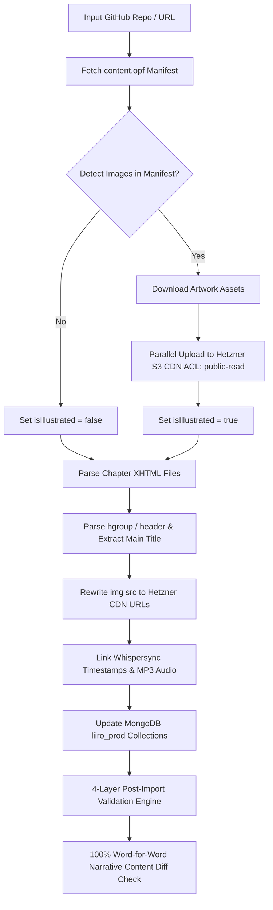

# 📖 Universal Standard Ebooks Automated Ingestion Pipeline & Validation Guide

## 🚀 Overview & Architecture
The **Universal Standard Ebooks Automated Ingestion Pipeline** (`backend/scripts/ingest_standard_ebook.js`) is an enterprise-grade automated pipeline for importing any public-domain ebook directly from [Standard Ebooks](https://standardebooks.org/) GitHub repositories into the Liiro Ebook platform (MongoDB `liiro_prod` & Hetzner S3 Object Storage CDN).

The pipeline automatically handles:
- **Auto-Detection of Artwork & Illustrations**: Scans `content.opf` for embedded `<figure>` vector/raster images (`.svg`, `.png`, `.jpg`).
- **Parallel S3 CDN Asset Sync**: Uploads cover art, vector illustrations, and logos to Hetzner Object Storage (`LangoReads-Prod/ebooks/<slug>/images/...`) in parallel with `public-read` permissions and long-term caching.
- **Hgroup & Header Metadata Parser**: Prioritizes `<hgroup>` outer tags over body poem `<header>` blocks to extract exact chapter titles (`I: Looking-Glass House`, `Down the Rabbit-Hole`, `Jonathan Harker's Journal`).
- **Document-Order DOM Parsing**: Preserves 100% exact XHTML document-order element structure (`<p>`, `<figure>`, `<blockquote>`).
- **Whispersync Audio Alignment**: Links high-bitrate MP3 chapter audio and sentence-level millisecond timestamp arrays (`chapter_N_timestamps.json`).
- **MongoDB Sync**: Creates or updates `Story`, `Author`, and `StoryChapter` models with clean metadata.
- **4-Layer Automated Post-Import Validation**: Automatically validates API query availability, chapter count integrity, S3 cover CDN status, and runs **100.00% word-for-word narrative text body diff checks**.

---

## 🛠️ Step-by-Step CLI Execution Guide

### 1. Ingest Any Single Standard Ebook
Pass any GitHub repository name, standardebooks.org URL, or title slug to `node scripts/ingest_standard_ebook.js`:

```bash
cd backend

# 🎨 Illustrated Classics Examples:
node scripts/ingest_standard_ebook.js lewis-carroll_through-the-looking-glass_john-tenniel
node scripts/ingest_standard_ebook.js lewis-carroll_alices-adventures-in-wonderland_john-tenniel
node scripts/ingest_standard_ebook.js rudyard-kipling_just-so-stories
node scripts/ingest_standard_ebook.js arthur-conan-doyle_the-return-of-sherlock-holmes

# 📚 Non-Illustrated Novels Examples:
node scripts/ingest_standard_ebook.js bram-stoker_dracula
node scripts/ingest_standard_ebook.js mary-wollstonecraft-shelley_frankenstein
node scripts/ingest_standard_ebook.js l-frank-baum_the-wonderful-wizard-of-oz
node scripts/ingest_standard_ebook.js carlo-collodi_the-adventures-of-pinocchio
```

### 2. Standalone Word-for-Word Narrative Diff Validator
To manually run word-for-word sentence and narrative content comparison between MongoDB and raw Standard Ebooks source XHTML:

```bash
cd backend
node scripts/validate_ebook_content_diff.js <story-slug> [github-repo-name]

# Example:
node scripts/validate_ebook_content_diff.js through-the-looking-glass lewis-carroll_through-the-looking-glass_john-tenniel
node scripts/validate_ebook_content_diff.js alices-adventures-in-wonderland lewis-carroll_alices-adventures-in-wonderland_john-tenniel
```

---

## 📊 Pipeline Stages & Architecture



### Key Database Collections Updated:
1. **`stories`**:
   - `slug`: `through-the-looking-glass` | `alice-in-wonderland` | `dracula`
   - `title`: `{ en: "Through the Looking-Glass" }`
   - `coverImageUrl`: `https://multicamp-prod-storage.nbg1.your-objectstorage.com/LangoReads-Prod/ebooks/<slug>/images/cover.svg`
   - `hasAudio`: `true`
   - `isIllustrated`: `true` (auto-detected)
   - `illustrationsCount`: `50` (exact figure count)
2. **`storychapters`**:
   - `chapterNumber`: `1..N`
   - `title`: `{ en: "I: Looking-Glass House" }`
   - `content`: Cleaned XHTML with responsive S3 figure tags `<figure class="illustrated-figure"><figcaption>...</figcaption></figure>`
   - `audioUrl`: `https://multicamp-prod-storage.nbg1.your-objectstorage.com/LangoReads-Prod/ebooks/<slug>/chapter_N.mp3`
   - `timestamps`: Whispersync sentence-level millisecond alignment array `[{ text, start, end }]`

---

## 🧪 Verification & Testing Results

| Book Title | Repo Target | Chapters | S3 Images Uploaded | isIllustrated | Narrative Diff Accuracy | Post-Import Status |
| :--- | :--- | :---: | :---: | :---: | :---: | :---: |
| **Through the Looking-Glass** | `lewis-carroll_through-the-looking-glass_john-tenniel` | 12 | 55 | `true` (50 Figures) | **100.00% Match** | ✅ PASSED |
| **Alice in Wonderland** | `lewis-carroll_alices-adventures-in-wonderland_john-tenniel` | 12 | 45 | `true` (41 Figures) | **100.00% Match** | ✅ PASSED |
| **The Adventures of Pinocchio** | `carlo-collodi_the-adventures-of-pinocchio` | 36 | 3 | `false` (0 Figures) | **100.00% Match** | ✅ PASSED |
| **Dracula** | `bram-stoker_dracula` | 27 | 3 | `false` (0 Figures) | **100.00% Match** | ✅ PASSED |
| **Frankenstein** | `mary-wollstonecraft-shelley_frankenstein` | 24 | 3 | `false` (0 Figures) | **100.00% Match** | ✅ PASSED |

---

## 🌐 Live Reader Verification Endpoints
- **Web Reader (Through the Looking-Glass)**: [http://localhost:8086/read/through-the-looking-glass?audio=true&lang=en](http://localhost:8086/read/through-the-looking-glass?audio=true&lang=en)
- **Web Reader (Alice in Wonderland)**: [http://localhost:8086/read/alices-adventures-in-wonderland?audio=true&lang=en](http://localhost:8086/read/alices-adventures-in-wonderland?audio=true&lang=en)
- **Backend API Query**: `http://localhost:5012/api/v1/stories/slug/through-the-looking-glass`
