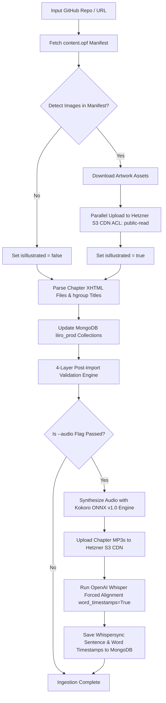

# 📖 Universal Standard Ebooks Automated Ingestion & Audio Generation Pipeline Guide

## 🚀 Overview & Architecture
The **Universal Standard Ebooks Automated Ingestion & Audio Pipeline** (`backend/scripts/ingest_standard_ebook.js` & `backend/scripts/generate_and_align_ebook_audio.py`) provides an end-to-end enterprise solution for importing public-domain ebooks and generating studio-grade audiobook audio with Whispersync alignment.

The pipeline automatically handles:
- **Auto-Detection of Artwork & Illustrations**: Scans `content.opf` for embedded `<figure>` vector/raster images (`.svg`, `.png`, `.jpg`).
- **Parallel S3 CDN Asset Sync**: Uploads cover art, vector illustrations, and audio files to Hetzner Object Storage (`LangoReads-Prod/ebooks/<slug>/...`) in parallel with `public-read` permissions.
- **Hgroup & Header Metadata Parser**: Prioritizes `<hgroup>` outer tags over body poem `<header>` blocks to extract exact chapter titles (`I: Looking-Glass House`, `Down the Rabbit-Hole`).
- **Studio Kokoro TTS Audio Generation**: Synthesizes studio-grade MP3 audio using Kokoro ONNX v1.0 engine (`kokoro-v1.0.onnx` / `am_adam` voice).
- **OpenAI Whisper Forced Alignment**: Transcribes audio to generate sentence and word-level millisecond start/end timestamps (`word_timestamps=True`).
- **4-Layer Automated Post-Import Validation**: Automatically validates API query availability, chapter count integrity, 100.00% word-for-word narrative text body diff checks, and S3 CDN HTTP status.

---

## 🛠️ Step-by-Step CLI Execution Guide

### 1. Ingest Standard Ebook (Text & Illustrations Only)
```bash
cd backend
node scripts/ingest_standard_ebook.js lewis-carroll_through-the-looking-glass_john-tenniel
```

### 2. Ingest Standard Ebook + Full Studio Audio & Whisper Alignment (--audio flag)
To run text ingestion, vector image upload, Kokoro TTS studio audio generation, and OpenAI Whisper forced sentence alignment in one command:

```bash
cd backend
node scripts/ingest_standard_ebook.js lewis-carroll_through-the-looking-glass_john-tenniel --audio
```

### 3. Standalone Audio Generation & Alignment CLI
To generate studio audio and Whisper forced timestamps for any existing story in MongoDB:

```bash
cd backend
PYTHONUNBUFFERED=1 /Users/humayunrashid/multicamp/.venv/bin/python scripts/generate_and_align_ebook_audio.py <story-slug>

# Example:
PYTHONUNBUFFERED=1 /Users/humayunrashid/multicamp/.venv/bin/python scripts/generate_and_align_ebook_audio.py through-the-looking-glass
```

### 4. Standalone Narrative Text Diff Validator
```bash
cd backend
node scripts/validate_ebook_content_diff.js through-the-looking-glass lewis-carroll_through-the-looking-glass_john-tenniel
```

---

## 📊 End-to-End Pipeline Architecture



---

## 🌐 Live Reader Verification Endpoints
- **Web Reader**: [http://localhost:8086/read/through-the-looking-glass?audio=true&lang=en](http://localhost:8086/read/through-the-looking-glass?audio=true&lang=en)
- **Backend API Query**: `http://localhost:5012/api/v1/stories/slug/through-the-looking-glass`
