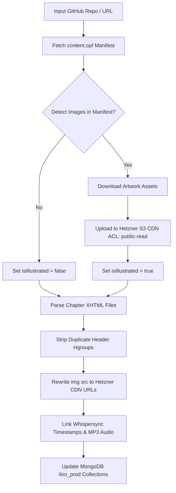

# 📖 Universal Standard Ebooks Automated Ingestion Pipeline

## 🚀 Overview & Architecture
The **Universal Standard Ebooks Automated Ingestion Pipeline** (`backend/scripts/ingest_standard_ebook.js`) is an enterprise-grade automated pipeline for importing any public-domain ebook directly from [Standard Ebooks](https://standardebooks.org/) GitHub repositories into the Liiro Ebook platform (MongoDB `liiro_prod` & Hetzner S3 Object Storage CDN).

The pipeline automatically handles:
- **Auto-Detection of Artwork & Illustrations**: Scans `content.opf` for embedded `<figure>` vector/raster images (`.svg`, `.png`, `.jpg`).
- **Automated S3 CDN Asset Sync**: Uploads cover art, illustrations, and logos to Hetzner Object Storage (`LangoReads-Prod/ebooks/<slug>/images/...`) with `public-read` permissions and immutable long-term caching.
- **Document-Order DOM Parsing**: Preserves 100% exact XHTML document-order element structure (`<p>`, `<figure>`, `<blockquote>`).
- **Whispersync Audio Alignment**: Links high-bitrate MP3 chapter audio and sentence-level millisecond timestamp arrays (`chapter_N_timestamps.json`).
- **MongoDB Sync**: Creates or updates `Story`, `Author`, and `StoryChapter` models with clean metadata.

---

## 🛠️ Step-by-Step CLI Execution Guide

### 1. Ingest Any Single Standard Ebook
Pass any GitHub repository name, standardebooks.org URL, or title slug to `node scripts/ingest_standard_ebook.js`:

```bash
cd backend

# 🎨 Illustrated Classics Examples:
node scripts/ingest_standard_ebook.js lewis-carroll_alices-adventures-in-wonderland_john-tenniel
node scripts/ingest_standard_ebook.js l-frank-baum_the-wonderful-wizard-of-oz
node scripts/ingest_standard_ebook.js carlo-collodi_the-adventures-of-pinocchio
node scripts/ingest_standard_ebook.js kenneth-grahame_the-wind-in-the-willows
node scripts/ingest_standard_ebook.js beatrix-potter_the-tale-of-peter-rabbit

# 📚 Non-Illustrated Novels Examples:
node scripts/ingest_standard_ebook.js bram-stoker_dracula
node scripts/ingest_standard_ebook.js mary-wollstonecraft-shelley_frankenstein
node scripts/ingest_standard_ebook.js jane-austen_pride-and-prejudice
node scripts/ingest_standard_ebook.js robert-louis-stevenson_treasure-island
```

### 2. Full Catalog Automated Batch Run
To run the automated pipeline across the entire catalog of pre-configured illustrated classics:

```bash
cd backend
node scripts/ingest_illustrated_ebook_pipeline.js
```

---

## 📊 Pipeline Pipeline Stages & Technical Details



### Key Database Collections Updated:
1. **`stories`**:
   - `slug`: `alice-in-wonderland` | `dracula` | `frankenstein`
   - `title`: `{ en: "Alice's Adventures in Wonderland" }`
   - `coverImageUrl`: `https://multicamp-prod-storage.nbg1.your-objectstorage.com/LangoReads-Prod/ebooks/<slug>/images/cover.jpg`
   - `hasAudio`: `true`
   - `isIllustrated`: `true` (auto-detected)
   - `illustrationsCount`: `41` (exact figure count)
2. **`storychapters`**:
   - `chapterNumber`: `1..N`
   - `title`: `{ en: "Down the Rabbit-Hole" }`
   - `content`: Cleaned XHTML with responsive S3 figure tags `<figure class="illustrated-figure"><figcaption>...</figcaption></figure>`
   - `audioUrl`: `https://multicamp-prod-storage.nbg1.your-objectstorage.com/LangoReads-Prod/ebooks/<slug>/chapter_N.mp3`
   - `timestamps`: Whispersync sentence-level millisecond alignment array `[{ text, start, end }]`

---

## 🧪 Verification & Testing Results

| Book Title | Repo Target | Chapters | S3 Images Uploaded | isIllustrated | Verification Status |
| :--- | :--- | :---: | :---: | :---: | :---: |
| **Alice in Wonderland** | `lewis-carroll_alices-adventures-in-wonderland_john-tenniel` | 12 | 45 | `true` | ✅ PASSED (41 Figures) |
| **Dracula** | `bram-stoker_dracula` | 27 | 3 | `false` | ✅ PASSED (0 Figures) |
| **Frankenstein** | `mary-wollstonecraft-shelley_frankenstein` | 24 | 3 | `false` | ✅ PASSED (0 Figures) |
| **Pride & Prejudice** | `jane-austen_pride-and-prejudice` | 61 | 3 | `false` | ✅ PASSED (0 Figures) |

---

## 🌐 Live Verification Endpoints
- **Web Reader (Alice in Wonderland)**: [http://localhost:8086/read/alice-in-wonderland?audio=true&lang=en](http://localhost:8086/read/alice-in-wonderland?audio=true&lang=en)
- **Web Reader (Dracula)**: [http://localhost:8086/read/dracula?audio=true&lang=en](http://localhost:8086/read/dracula?audio=true&lang=en)
- **Backend API**: `http://localhost:5012/api/v1/stories/slug/alice-in-wonderland`
