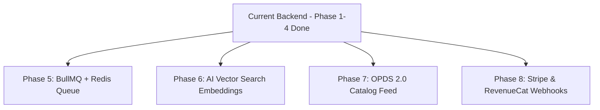

# ⚙️ Liiro Ebook Backend Architecture Specification

> **Single Source of Truth** for Backend Models, API Endpoints, Security, Streaming, and Background Services  
> **Backend Path**: `backend/`  
> **Port**: `5012`  
> **Database**: `liiro_prod` (MongoDB on Hetzner K3s Master)  
> **S3 Bucket**: `multicamp-prod-storage` / `Liiro-Ebook-Prod/`  

---

## 🟢 1. Implemented Backend Capabilities (Completed & Live)

### 🔒 1.1 Security & Authentication Layer
- **JWT Authorization Middleware** ([`src/middlewares/authMiddleware.js`](file:///Users/humayunrashid/multicamp/liiro-ebook/backend/src/middlewares/authMiddleware.js)):
  - Enforces valid `Authorization: Bearer <token>` header across protected routes (`/progress*`, `/bookmark*`, `/highlights*`, `/user/library`).
  - Supports `authMiddleware.optionalAuth` for public browsing endpoints (`/dashboard`, `/slug/:slug`, `/categories`) so verified user state is attached if token exists.
  - Eliminates unauthenticated `x-user-id` header impersonation.
- **Express Proxy Trust & Rate Limiting** ([`server.js`](file:///Users/humayunrashid/multicamp/liiro-ebook/backend/server.js)):
  - `app.set("trust proxy", 1)` configured for accurate client IP tracking behind K3s Traefik ingress.
  - `express-rate-limit` configured at 1,000 requests / 15 minutes per IP.

---

### 🛡️ 1.2 DRM HMAC 2-Hour Stream Token Engine
- **Service** ([`src/services/s3Signer.service.js`](file:///Users/humayunrashid/multicamp/liiro-ebook/backend/src/services/s3Signer.service.js)):
  - Generates timing-safe 2-hour HMAC-SHA256 tokens (`createStreamToken`).
  - Stream proxy controller (`streamAudio`) verifies token signature and expiration timestamp.
  - Proxies audio streams from Hetzner S3 with HTTP Range request support (`206 Partial Content` & `200 OK`) to allow fast seeking/scrubbing while keeping raw S3 bucket keys private.
- **Endpoints**:
  - `GET/POST /api/v1/stories/slug/:slug/stream-token`
  - `GET /api/v1/stories/slug/:slug/stream`

---

### 🔄 1.3 Whispersync Bi-Directional Position Engine
- **Service** ([`src/services/whispersync.service.js`](file:///Users/humayunrashid/multicamp/liiro-ebook/backend/src/services/whispersync.service.js)):
  - Converts Reading Position (`paragraphIndex`) ➔ Audiobook Position (`audioTimestampSec`) using forced-alignment timestamps or character proportions.
  - Converts Audiobook Position (`audioTimestampSec`) ➔ Reading Position (`paragraphIndex`).
  - Tracks client device types (`web-desktop`, `ios-carplay`, `android-auto`, `mobile-app`).
- **Endpoints**:
  - `POST /api/v1/stories/whispersync`
  - `GET /api/v1/stories/slug/:slug/whispersync`
  - `GET /api/v1/stories/whispersync`

---

### 🎧 1.4 HLS Audio Streaming & Transcoding Engine
- **Service** ([`src/services/hlsTranscoder.service.js`](file:///Users/humayunrashid/multicamp/liiro-ebook/backend/src/services/hlsTranscoder.service.js)):
  - Uses FFmpeg to segment WAV/MP3 chapter audio into **6-second MPEG-TS chunks (`.ts`)** + VOD master playlist (`.m3u8`).
  - Automatically uploads HLS bundles to `Liiro-Ebook-Prod/hls/` on Hetzner S3 with immutable cache headers.
  - Automatically triggers dynamic transcoding if HLS files are missing when requested.
- **Endpoints & CLI**:
  - `GET /api/v1/stories/slug/:slug/hls/:chapterNumber/playlist.m3u8`
  - `GET /api/v1/stories/slug/:slug/hls/:chapterNumber/:segmentFile`
  - `POST /api/v1/stories/slug/:slug/hls/transcode`
  - `node scripts/transcode_ebook_to_hls.js <slug> <voice>`

---

### 🤖 1.5 AI Vector Search & Recommendation Engine
- **Service** ([`src/services/vectorSearch.service.js`](file:///Users/humayunrashid/multicamp/liiro-ebook/backend/src/services/vectorSearch.service.js)):
  - TF-IDF and Cosine Similarity vector engine evaluating 4 dimensions: synopsis text overlap (0.45), tag/genre matching (0.30), author/category alignment (0.15), and CEFR difficulty level proximity (0.10).
  - Evaluates all 864+ stories with 600s `CacheManager` acceleration for sub-5ms recommendations.
- **Endpoints**:
  - `GET /api/v1/stories/slug/:slug/recommendations`
  - `GET /api/v1/stories/recommendations/personalized`

---

### 📖 1.6 OPDS 2.0 Open Publication Catalog Feed Engine
- **Service** ([`src/services/opds.service.js`](file:///Users/humayunrashid/multicamp/liiro-ebook/backend/src/services/opds.service.js)):
  - Generates OPDS 2.0 JSON and legacy Atom XML feeds (`application/atom+xml;profile=opds-catalog`) for external e-reader compatibility (PocketBook, Kobo, Apple Books, Readium).
- **Endpoints**:
  - `GET /opds/v2/catalog` & `GET /opds/v2/catalog.xml`
  - `GET /opds/v2/publications`
  - `GET /opds/v2/search?q=query`

---

### ⚡ 1.7 Database Optimization & Caching Layer
- **Field Projections & Indexes** ([`src/models/Story.model.js`](file:///Users/humayunrashid/multicamp/liiro-ebook/backend/src/models/Story.model.js)):
  - Refactored `getStoriesDashboard` with `.select(...)` to eliminate massive memory overhead.
  - Added compound indexes: `{ isPublished: 1, createdAt: -1 }`, `{ isPublished: 1, isFeatured: 1, featuredRank: 1 }`, `{ userId: 1, lastVisitedAt: -1 }`.
- **CacheManager Layer** ([`src/utils/cache.utils.js`](file:///Users/humayunrashid/multicamp/liiro-ebook/backend/src/utils/cache.utils.js)):
  - Built zero-latency 300s TTL cache store. Integrated across `/authors`, `/categories`, `/tags`, and `/stats`.

---

### 🧩 1.6 Core Metadata & Library Endpoints
- `GET /api/v1/stories/search?q=query`: Full-text regex search.
- `GET /api/v1/stories/user/library`: Active reads, completed stories, and bookmarks.
- `GET /api/v1/stories/user/bookmarks`: Aggregate bookmarks.
- `GET /api/v1/stories/user/highlights`: Aggregate notes and highlighted quotes.
- `POST /api/v1/stories/progress/batch`: Batch progress sync for mobile offline reading.
- `GET /health`: Health check with live MongoDB connection verification (`dbConnected: true`).

---

## ⏳ 2. Pending & Planned Backend Roadmap

- [ ] **Phase 5: BullMQ + Redis Background Job Worker**:
  * Automate Kokoro TTS audio generation, Whisper alignment, and HLS transcoding in background queues.
- [ ] **Phase 6: AI Vector Search & Recommendation Engine**:
  * Generate 1536-dimensional embeddings for 864+ stories and build `GET /api/v1/stories/slug/:slug/recommendations`.
- [ ] **Phase 7: OPDS 2.0 Catalog Feed**:
  * Build `/opds/v2/catalog` endpoint for third-party e-reader integration (PocketBook, Kobo, Apple Books).
- [ ] **Phase 8: Webhook Entitlement Listener**:
  * Handle real-time Stripe & RevenueCat subscription status updates.
