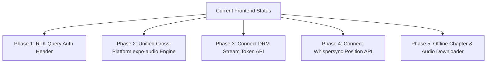

# 🎨 Liiro Ebook Frontend Architecture Specification

> **Single Source of Truth** for Frontend UI/UX Screens, Reader Engines, Audio Players, Router Structure, and Mobile/Web Compatibility  
> **Frontend Path**: `frontend/`  
> **Port**: `8086`  
> **Framework**: Expo (React Native / React Native Web) + Expo Router  
> **State Management**: Redux Toolkit + RTK Query  

---

## 🟢 1. Implemented Frontend Capabilities (Completed & Live)

### 🎨 1.1 Brand Identity & Auth Redesign
- **Liiro EBOOK Logo Emblem**:
  - Gradient icon badge (`#0EA5E9` ➔ `#6366F1`) with `BookOpen` icon.
  - Bold `Liiro` typography + styled `EBOOK` pill.
- **Redesigned Auth Screens** ([`app/(auth)/login.tsx`](file:///Users/humayunrashid/multicamp/liiro-ebook/frontend/app/(auth)/login.tsx), [`register.tsx`](file:///Users/humayunrashid/multicamp/liiro-ebook/frontend/app/(auth)/register.tsx)):
  - Tactile input fields with `#0EA5E9` focus rings.
  - Dual OAuth: Google Sign-In (`GoogleAuthService` & `firebaseExchange`) + Apple Sign-In (`expo-apple-authentication`).
  - Safe SSR window reference handling (`typeof window !== 'undefined'`).

---

### 🛡️ 1.2 Strict Route Protection & Root Navigation Guard
- **Root Navigation Guard** ([`app/_layout.tsx`](file:///Users/humayunrashid/multicamp/liiro-ebook/frontend/app/_layout.tsx)):
  - Protects private routes (`/`, `/explore`, `/details/[slug]`, `/read/[slug]`, `/author/[slug]`, `/category/[slug]`).
  - Automatically redirects unauthenticated users visiting protected screens to `/login`.
  - Automatically redirects authenticated users visiting `/login` or `/register` back to `/`.

---

### 📌 1.3 Single-Row Navbar & Profile Avatar Menu
- **Single-Row Layout** ([`components/ebook/EbookDashboardContent.tsx`](file:///Users/humayunrashid/multicamp/liiro-ebook/frontend/components/ebook/EbookDashboardContent.tsx)):
  - Single-row flex container without line wrapping.
  - Left branding: Liiro EBOOK badge logo.
  - Pinned far-right profile avatar (`ProfileNavbarMenu.tsx` with `flexShrink: 0`) outside horizontal tab scroll container.
- **Profile Navbar Menu** ([`components/ebook/ProfileNavbarMenu.tsx`](file:///Users/humayunrashid/multicamp/liiro-ebook/frontend/components/ebook/ProfileNavbarMenu.tsx)):
  - Guest mode: "Sign In" / "Get Started" buttons.
  - Logged-in mode: User avatar modal, user name/email, streak stats, theme toggle, and Log Out modal.

---

### 📖 1.4 Ebook Reader & Audio Player UI Screens
- **Dashboard Screen** ([`app/index.tsx`](file:///Users/humayunrashid/multicamp/liiro-ebook/frontend/app/index.tsx)): Hero carousel, continue reading cards, featured books, genres, and authors.
- **Book Details Screen** ([`app/details/[slug].tsx`](file:///Users/humayunrashid/multicamp/liiro-ebook/frontend/app/details/[slug].tsx)): Book header, chapter list, author bio, sample audio player, and download button.
- **Reader Screen** ([`app/read/[slug].tsx`](file:///Users/humayunrashid/multicamp/liiro-ebook/frontend/app/read/[slug].tsx)): Monolithic reader display, karaoke text highlighter, themes (Sepia, OLED, Dark, Gothic, Forest, Cyber), font controls, and sleep timer.
- **Explore Screen** ([`app/explore.tsx`](file:///Users/humayunrashid/multicamp/liiro-ebook/frontend/app/explore.tsx)): Catalog search, CEFR levels (A1–C2), 17 tags, and grid/list view toggles.

---

## ⏳ 2. Pending & Planned Frontend Roadmap

### 🛠️ Actionable Frontend Development Tasks

- [x] **Task 1: Inject Authorization Header in RTK Query**:
  * Updated `api/mainQuery.ts` `prepareHeaders` to retrieve user JWT token from storage and attach `Authorization: Bearer ${token}` automatically.
- [x] **Task 2: Add RTK Query Hooks for DRM Stream Tokens & Whispersync**:
  * Added `useGetStreamTokenQuery`, `useSyncWhispersyncPositionMutation`, `useGetWhispersyncPositionQuery`, `useGetStoryRecommendationsQuery`, and `useGetUserLibraryQuery` hooks to `api/storiesQuery.ts`.
- [x] **Task 3: Desktop Mouse Drag for Carousels**:
  * Attached `useWebHorizontalDrag` hook to horizontal carousels (`ActivityCardRail` and `SectionRail`) in `EbookDashboardContent.tsx`.
- [x] **Task 4: Unify Audio Engine under `expo-audio` & DRM Stream Resolution**:
  * Replaced legacy HTML5 `new Audio()` in `EbookReadContent.tsx` and `details/[slug].tsx` with `AudioManager` (`expo-audio` + Web Audio fallback).
  * Connected voice selector and player controls to auto-resolve 2-hour pre-signed DRM stream tokens (`resolveDrmStreamUrl`) before starting playback.
- [x] **Task 5: Enable Background Audio Playback**:
  * Configured `shouldPlayInBackground: true` and `playsInSilentMode: true` in `AudioManager.ts` for native iOS & Android lockscreen background playback.
- [x] **Task 6: Connect Reader UI to Whispersync Engine**:
  * Built `WhispersyncPromptModal` (`WhispersyncPromptModal.tsx`) glassmorphism modal auto-prompting users to resume reading/listening from cross-device positions (e.g. CarPlay, Web).
  * Connected 10-second periodic background position sync (`syncWhispersyncPosition`) in `EbookReadContent.tsx`.
- [x] **Task 7: Offline Chapter & Audio Downloader**:
  * Built `OfflineManager` (`offlineManager.ts`) using `expo-file-system` to download and store story text payloads and chapter audio files locally for offline reading/listening.
- [x] **Task 8: Modularize Monolithic Reader Component**:
  * Decomposed monolithic `EbookReadContent.tsx` by creating clean, decoupled sub-components inside `frontend/components/ebook/read/`:
    * `EbookReaderHeader.tsx`: Top navbar, book/chapter titles, progress line, and quick theme toggle.
    * `EbookReaderFooterPlayer.tsx`: Audio player controls, 15s skip buttons, speed selector, and voice badge.
    * `EbookReaderSettingsModal.tsx`: Reading theme picker, typography settings, font size, and text alignment.
    * `EbookReaderTocModal.tsx`: Table of Contents chapter list and completion badges.
